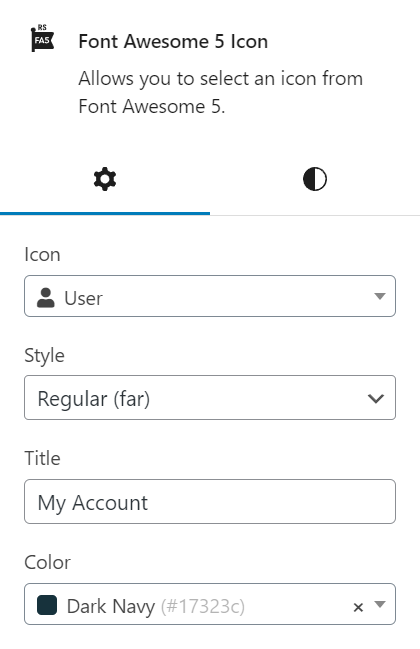
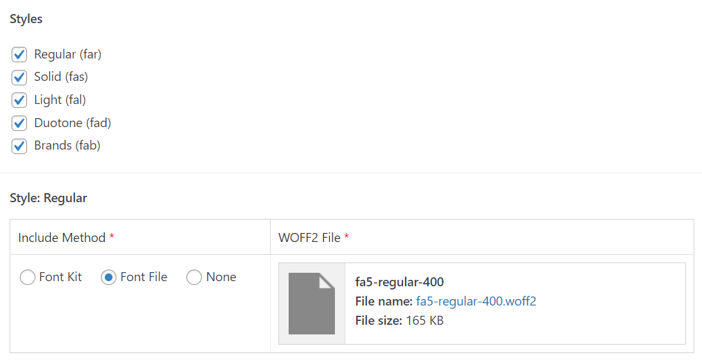
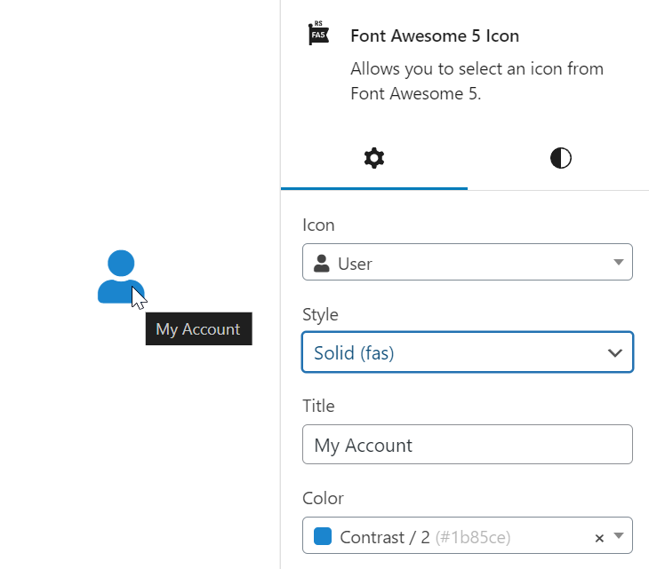
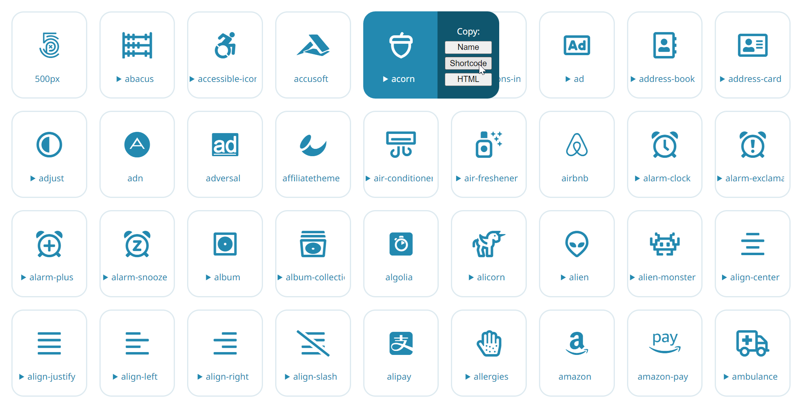

# RS Font Awesome 5 (WordPress Plugin)

This plugin enables you to add icons from Font Awesome 5. You can include your Font Awesome scripts by using an official kit, by uploading font files, or by deferring to another plugin which already includes them.

Icons can be inserted using the Font Awesome 5 Icon block or the [fa5] shortcode.

This plugin **requires** Advanced Custom Fields Pro to be installed and active.



```
Contributors: radgh
Requires at least: 6.0
Tested up to: 6.5.2
Requires PHP: 8.0
License: GPLv3
License URI: http://www.gnu.org/licenses/gpl-3.0.txt
```

### Getting Started

Before you can start using icons, you need to visit the settings page under Settings > RS Font Awesome 5. Here you can enable the plugin and select which icon styles are available.

Each icon style requires a separate CSS file to be loaded. You can upload the individual `.woff2` file for each style directly through WordPress, or you can embed your own kit.



### Block Usage

The block features the following fields:

- **Icon:** Search or browse icons using a Select2 dropdown.
- **Style:** Choose the style from: regular, solid, light, or duotone
  _(Brands do not support styles)_
- **Title:** Add a title to show on hover. If empty, the icon will be treated as decorative by adding `aria-hidden="true"` for accessibility.
- **Color:** Choose a color for the icon from colors defined in the theme.json file. If empty, the icon will inherit the text color.
- **Color 2:** If duotone style is selected, a second color dropdown appears so you can select both colors.



### Shortcode usage:

The shortcode is flexible and supports the same features as the block.

| Attribute                | Description                                                |
|--------------------------|------------------------------------------------------------|
| Short syntax             | `[fa5 user]`                                               |
| Alternate syntax         | `[fa5 icon="user"]`                                        |
| Icon with title          | `[fa5 user title="My Account"]`                            |
| Solid icon style         | `[fa5 user style="solid"]`                                 |
| Orange colored icon      | `[fa5 user color="orange"]`                                |
| Duotone icon, two colors | `[fa5 user style="duotone" color="blue" color_2="orange"]` |

In addition, you can use the shortcode `[fa]` or `[icon]` as an alias for `[fa5]`, and all methods support using "icon", "name", or "type" as the icon name. This is useful if you are migrating from a different plugin or theme that uses a different shortcode.

### Display all icons

You can display a list of all icons using the shortcode: ```[fa5_icon_list]```

There are no settings for this shortcode. Here is a preview of the output:



### Supported Version

This plugin supports Font Awesome 5.15.4. All styles are supported, which currently includes:
  * Regular (far)
  * Solid (fas)
  * Brands (fab)
  * Light (fal)
  * Duotone (fad)

## Changelog

### 1.0.3
* Fixed align center on icons

### 1.0.2
* Added a URL option to the block, with an option to open in new tab

### 1.0.1
* Added default icon if none is specified

### 1.0.0
* Initial release